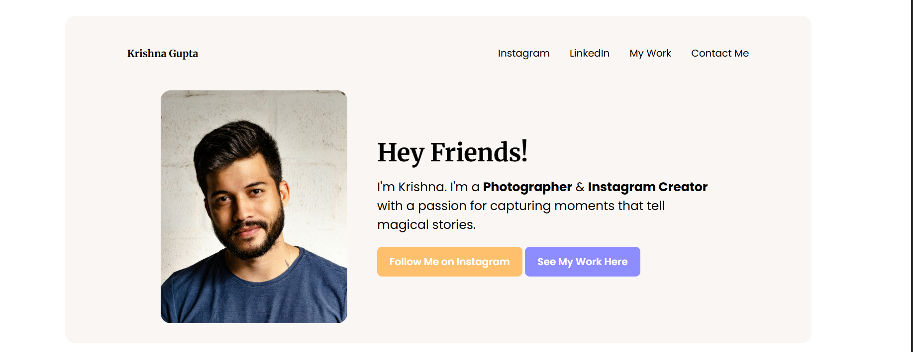
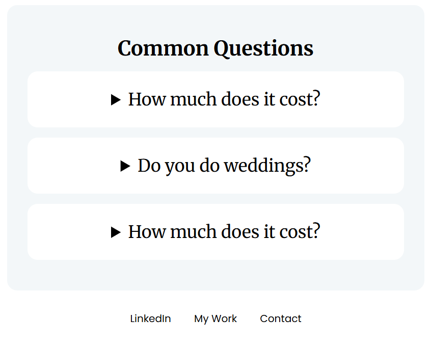

# 📸 Influencer Promo Landing Page

A modern and responsive **personal influencer portfolio website** built using HTML and CSS.  
This project showcases photography work, personal branding, services, and a clean aesthetic landing page design.

---

## 🚀 Features

- 🎨 Modern and minimal UI  
- 📱 Fully responsive layout  
- 🖼️ Beautiful image gallery section  
- ✨ Hover animations and smooth interactions  
- 📌 FAQ / Common Questions section  
- 🔗 Call-to-action buttons  
- 🌈 Soft aesthetic color palette  
- ⚡ Flexbox and CSS Grid based layout  

---

## 🛠️ Tech Stack

- HTML5  
- CSS3  
- Google Fonts  
- Flexbox  
- CSS Grid  

---

## 🧠 How It Works

- Uses Flexbox for responsive content alignment  
- Uses CSS Grid for the image gallery layout  
- Responsive spacing using modern CSS functions  
- Hover effects added for better interactivity  
- Clean typography using Merriweather and Poppins fonts  

---

## 📸 Preview

  

  
  

---

## 🚧 Future Improvements

- 🌙 Dark mode support  
- 📩 Functional contact form  
- 🎥 Video showcase section  
- 📱 Better mobile navigation menu  
- 🔗 Social media integration  
- ✨ Advanced animations using JavaScript  

---

## 🙌 Author

**Krishna Gupta**

---

## 📜 License

This project is open-source and free to use.
